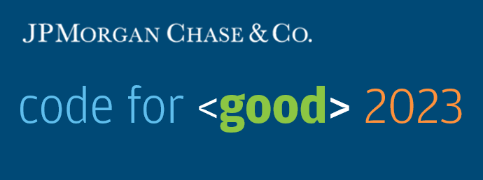
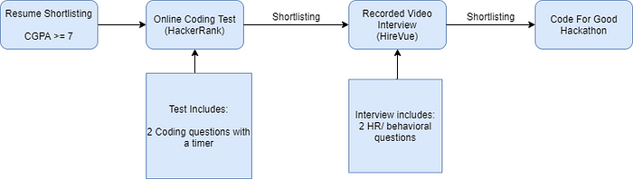
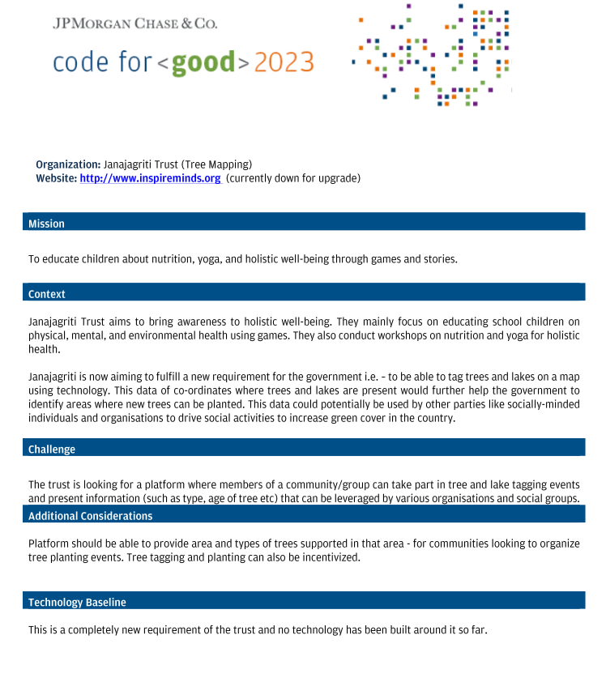
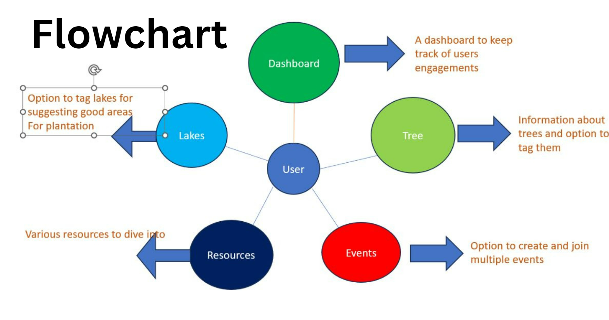
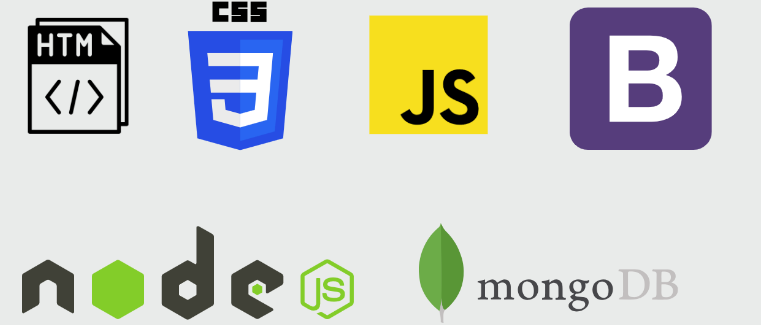

  

Code For Good is a 24 hour hackathon arranged by JPMC every year where college students collaborate to build innovative solutions for Non-Profit Organizations.

### Selection Procedure

  

#### Online Coding Test (Hackathon)

In the typical selection process, the initial online test usually takes place during the first or second week of February. The test comprises two coding questions that need to be solved within a time limit of 75 minutes. To prepare for this round, it is beneficial to practice Leetcode problems, focusing on topics such as Arrays, LinkedList, Strings, Queue, and Stack.

However, despite the high number of students passing all the test cases (around 80-90% of the batch), only 10 individuals from our second year batch were selected to participate in the hackathon. Thus, the actual shortlisting takes place during the interview round, where further assessment and evaluation occur.

#### Interview Round

Everyone who were selected for the second round got the links for recording their HireVue Interviews 2-3 weeks after the coding test. The question flashed on the screen for some 30 seconds and then the recording starts for the next 2/3 minutes where I had to speak my answer. The questions in this round were all behavioral. A simple google search before taking the interview gave me a list of frequent questions asked in a HireVue interviews.

#### Code for Good Hackathon

The hackathon organizers began sending out acceptance letters in June, notifying participants of their selection to participate in the event. The hackathon itself was scheduled to take place in the third week of July (15th and 16th July).

This time Code for Good was a virtual 24 hours hackathon. However, prior to the hackathon, there were a few days dedicated to ice-breaker sessions and workshops on Zoom. These sessions included topics such as the basics of Git, Q&A sessions related to the hackathon, and other relevant workshops to help participants prepare for the event. These activities aim to provide additional guidance and knowledge to the participants before they dive into the actual hackathon.

#### The Team

We got our tean nappings two days prior to the hackathon (13th July). Every team had a minimum of 5 students and a maximum of 7 members. Each team had 2-3 mentors from JPMC. Mentors are full time employees at JPMC whose feedback will be considered in deciding whether to offer you an internship at JPMC. Subject Matter Experts (SMEs) are available for everyone's help throughout the hackathon duration.

#### Before the Hackathon

Our team held multiple zoom meetings to get acquainted with each other and also to plan for the hackathon. We decided to divide our team into Frontend and Backend. Apparently it turns out that our team had more people experienced in Frontend technologies than in backend. So there were 5 students for frontend and 2 for backend. I was in the backend team and created the backend for authentication.

Before the hackathon began, we created a basic structure of our project. We decided to use Node JS for backend and HTML, CSS, Vanilla JS for the frontend. Templates of basic web pages like Home , About Us, etc were kept ready and connected to the backend to save us time during the hackathon.

#### The day of the Hackathon

We were told during the zoom meetings that we shall be getting the Probelm Statements on the day of the hackathon itself and we will be having less time to select the problem statements as it will be allocated on FCFS (First Come First Serve) basis. Apparently the hackathon organizers released the problem statements one day prior to the hackathon and we started brain storming right away.

Initially only 4 problem statements were released but some team members had different problem statements which confused us a lot and we found it difficult to set the priority order of the problem statements. Anyways we decided the priority order of the problem statements.

The hackathon began at 11:30 am with the `Hackathon Survival Guide` meet. Problem statements were presented by the NGOs from 1pm in the form of video presentations and after those presentations we had to fill our preference order ASAP. Fortunately we got our first preference and our happiness knew no bounds. Following was our problem statement:

  

#### Our Solution

We created a web application where users can tag a tree or lake using location feature. User/organization can organize an event or register for one. Users can give information about medicinal properties of trees, age and species of the trees. We also created a live dashboard so as to see the data in an aggregated format and draw out conclusions. It also included a chat bot to assist the users in getting info about different species of trees.

The entire backend/APIs were created on NodeJS and the databases were on MongoDB.

  

#### Tech Stack Used

  

#### Round 1

The next day, we had to present a demo of our application along with a PPT at 10 am to the judges including some members of the NGO whose problem statement we were working on. This was the first round of judging, where 80% of the teams were eliminated. Initially we thought that we messed up since when the one of the judges asked some technical question regarding the map functionality, my PC suddenly stopped working and I got disconnected from the meet. Somehow my team members answered the question as I was the only one who worked on the map. We lost all hopes of getting to the second round but at 11:35 am we were surprised to know that our team was selected for the second round. Apparently the extra functionalities that we added to our web app got us into the second round.

#### Round 2

24 teams from 8 problem statements (3 teams per problem statement) made it to the second round. The second round was a technical screening rounds which was judged by the SMEs at JPMC. We were asked to show our code and had to answer questions about what algorithm we used, why we used it, the reason behind using the tech-stack used and so on…

#### Results

The second round ended at around 12:30 pm on the second day. The closing ceremony was supposed to begin at 1 pm. I was super tired but because of the adrenaline I could not sleep... I was just too excited for the results to be announced. The closing ceremonies began on time but to further build up our excitement, a couple of talks by the senior management at JPMC were arranged. After a loooong weekend, finally came the time of the announcement of the results. Here also, our problem statement was the 8th and the last one. Unfortunately we couldn't win the hackathon but we were happy with what we were able to put forward and the NGO's head were also very impressed with our solution. It was a tough call between our team and the winning team.

#### Final Words

Overall, it was a great experience, collaborating with students across India and building a product that soon will be used to solve a real-world problem and in turn, would help lakhs of students to build their skills further.

Here, I would like to express my thanks and gratitude to Rashmi, Preeti and Ganapati as well. They stood with us for the entire day of the hackathon and motivated us to build the right product while keeping the environment as friendly as possible. Thanks again guys, It wouldn’t have been possible without you guys.

Although it was a virtual event and I personally missed the energy blasts and talking to tons of people like we do at in-person events, but the organizers really did a great job and made the hackathon as close to an in-person event as possible. I also made some good friends along the way which I didn't expect to happen. This event will forever hold a special place in my heart. Despite being virtual, it exceeded my expectations by bringing together a fantastic community, sparking incredible energy, and unexpectedly forging meaningful friendships. It was an unforgettable experience that truly captured the essence of hackathons, even from behind our screens.
