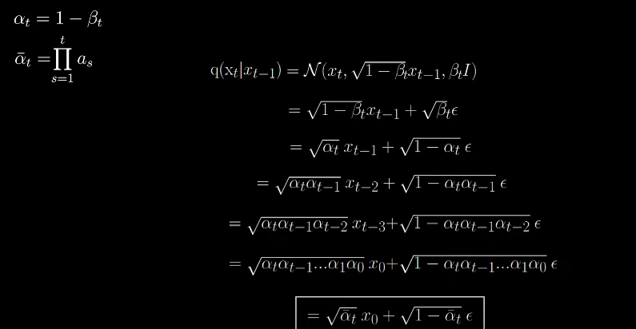
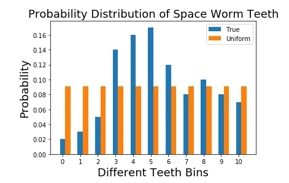
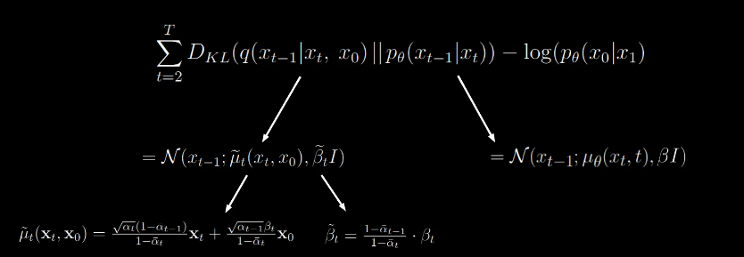

## Notations

The subscript represent the time steps.


At time step 0 we have the original input image. As time passes, we add more noise to the image.


For example X<sub>42</sub> will be hte image after applying 42 iterations of noise.


The final image which follows an isotropic Gaussian distribution will be called X<sub>0</sub>.


Next, we will define two functions.

## Forward Process


This defines the forward process which takes in an image and returns an image with a little bit more noise added to it.

In order to not get confused, we will always refer to (t-1) as an image with less noise.


Now we know how to apply one forward step. To run the process for 1000 times, we simply need to repeat this formula 1000 times. But there is another way in which this can be done in only a single step.

For that we need to define a little bit more notations:


From the reparameterization  trick:


We can arrive at the following:


Now here comes the trick. Now we can extend this to earlier time steps and go from (t-2) to t by just chaining the alphas and also from (t-3) to t and so on.




## Reverse Process

p(x<sub>(t-1)</sub>|x<sub>t</sub>)


This functions takes in an image X<sub>t</sub> and produces a sample X<sub>(t-1)</sub> using the neural net.


Our objective is to arrive at the formula which uses a neural network to predict the noise in an image between two time steps.

Now let's look at the loss function. 


It's simply the negative log likelihood function. 
But there is a problem. The probability of x<sub>0</sub> isn't nicely computable as it depends on all other time steps coming before x<sub>0</sub>starting at t. This would mean keeping track of t-1 steps which isn't possible practically. We can compute the variational lower bound for this objective and arrive at a more nicely computable formula.


The overall setup of diffusion model is pretty much similar to the autoencoder models.


### KL Divergence

KL divergence is a way of measuring the matching between two distributions.

We will be using the example found in this [blog post](https://www.countbayesie.com/blog/2017/5/9/kullback-leibler-divergence-explained).

<b>Problem:</b> 
we’re a group of scientists visiting the vast outer-space and we discovered some space worms. These space worms have varying number of teeth. Now we need to send this information back to earth. But sending information from space to earth is expensive. So we need need to represent this information with a minimum amount of information. A great way to do this is, instead of recording individual numbers, we draw a plot where X axis is different numbers of teeth that has been observed (0,1,2,…, etc.) and make Y axis the probability of seeing a worm with x many teeth (that is, number of worms with x teeth / total number of worms). We have converted our observations to a distribution.

This distribution is efficient than sending information about individual worms. But we can do better. We can represent this distribution with a known distribution (e.g. uniform, binomial, normal, etc.). For example, if we represent the true distribution with a uniform distribution, we only need to send two pieces of information to recover true data; the uniform probability and the number of worms. But how do we know which distribution explains the true distribution better? Well that’s where the KL divergence comes in.

So we could use the KL divergence to make sure that we matched the true distribution with some simple-to-explain and well-known distribution well.

To be able to check numerical correctness, let us change probability values to more human friendly values (compared to the values used in [1]). We will assume the following. Say we have 100 worms. And we have following types of worms in following amounts.

- 0 teeth: 2 (Probability: p0=0.02)
- 1 tooth: 3 (Probability: p1=0.03)
- 2 teeth: 5 (Probability: p2=0.05)
- 3 teeth: 14(Probability: p3=0.14)
- 4 teeth: 16 (Probability: p4=0.16)
- 5 teeth: 15 (Probability: p5=0.15)
- 6 teeth: 12 (Probability: p6=0.12)
- 7 teeth: 8 (Probability: p7=0.08)
- 8 teeth: 10 (Probability: p8=0.1)
- 9 teeth: 8 (Probability: p9=0.08)
- 10 teeth: 7 (Probability: p10=0.07)

Here’s what it looks visually:


<b>First try: Model this with a uniform distribution</b>

Now that out of the way, let us first try to model this distribution with a uniform distribution. A uniform distribution has only a single parameter; the uniform probability; the probability of a given event happening.

<i>p_uniform=1/total events=1/11 = 0.0909</i>

This is what the uniform distribution and the true distribution side-by-side looks like.



Let us keep this result aside and we will model the true distribution with another type of distributions.

<b>Second try: Model this with a binomial distribution</b>

You are probably familiar with the binomial probability through calculating probabilities of a coin landing on it’s head. We can extend the same concept to our problem. For a coin you have two possible outputs and assuming the probability of the coin landing on its head is p and you run this experiment for n trials, the probability getting k successes is given by,


Breaking down the equation

Let’s take a side trip and understand each term in the binomial distribution and see if they make sense. The first term is p^k. We want to get k successes, where the probability of a single success is p. Then the probability of getting k successes is p^k. Remember that we’re running the experiment for n trials. Therefore, there’s going to be n-k failed trials, with a failure probability of (1-p). So the probability of getting k successes is the joint probability of p^k (1-p)^{n-k}. Our work doesn’t end here. There are different permutations the k trials can take place within the n trials. The number of different permutations k elements to be arranged within n spaces is given by,


<b>Mean and variance of the binomial distribution</b>

We can also define a mean and a variance for a binomial distribution. These are given by,

`mean = np`

`variance = np(1-p)`

What does the mean reflect? Mean is the expected (average) number of successes you get if you run n trials. If each trial has a success probability of <b>p</b> it make sense to say you will get <b>np</b> successes if you run n trials. Next what does the variance represent. It represents how much the true number of success trials to deviate from the mean value. To understand the variance, let us assume <b>n=1</b>. Then the equation is, <b>variance=p(1-p)</b>. You have the highest variance when <.5>p=0.5</b> (when it is equally likely to get heads and tail) and lowest when <b>p=1</b> or <b>p=0</b> (when for sure you’re getting head/tail).

<b>Back to modeling</b>

Now with a solid understanding about the binomial distribution, let us spiral back to the problem at our hands. Let us first calculate the expected number of teeth for the worms. It would be,


With mean known, we can calculate p where,

`mean = np`

`5.44 = 10p`

`p = 0.544`

Note than n is the maximum number of teeth observed from the population of worms. You might ask why we did not choose n to be the total number of worms (that is 100) or total number of events (that is 11). We will soon see the reason. With that, we can define probabilities of any number of teeth as follows.

```
Given that teeth can take values up to 10, what is the probability of seeing k teeth (where seeing a tooth is a success trial).
```

From the perspective of the coin flip, this is like asking,

```
Given that I have 10 flips, what is the probability of observing k heads.
```

Formally, we calculate the probability pk^{bi} for all different values of k. Here k becomes the number of teeth we would like to observe. And pk^{bi} is the binomial probabilities for the k th bin of teeth (that is, 0 teeth, 1 tooth, etc.). So when we calculate them as follows,

`p0^{bi} = (10!/(0!10!)) 0.544⁰ (1–0.544)^{10} = 0.0004`

`p1^{bi} = (10!/(1!9!)) 0.544¹ (1–0.544)⁹ = 0.0046`

`p2^{bi} = (10!/(2!8!)) 0.544² (1–0.544)⁸ = 0.0249`

`…`

`p9^{bi} = (10!/(9!1!)) 0.544⁹ (1–0.544)¹ = 0.0190`

`p10^{bi} = (10!/(10!0!)) 0.544^{10} (1–0.544)⁰ = 0.0023`

This is what a comparison between the true distribution and the binomial distribution looks like.


<b>Let’s summarize what we have</b>

Okay, turn back and reflect on what we did so far. First we understood the problem we want to solve. The problem is to send statistics of teeth of a certain type of space worms across the space with minimal effort. For that we thought of representing the true statistics of worms with some known distribution, so we can just send the parameter of that distribution instead of true statistics. We looked at two types of distributions and came up with the following statistics.

* Uniform distribution — with probability of 0.0909
* Binomial distribution — with n=10, p=0.544 and k taking different values between 0 to 10

Now let’s visualize everything in one place.


<b>How do we quantitatively decide which ones the best?</b>

Now with all these fancy calculations, we need a way to measure the matching between each approximated distribution and the true distribution. This is important, so that, when we send the information across, we can have a peace of mind without worrying about the question “did I choose correctly?” for the rest of our lives.

This is where the KL divergence comes in. KL divergence is formally defined as follows.


Here q(x) is the approximation and p(x) is the true distribution we’re interested in matching q(x) to. Intuitively this measures the how much a given arbitrary distribution is away from the true distribution. If two distributions perfectly match, D_{KL} (p||q) = 0 otherwise it can take values between 0 and ∞. Lower the KL divergence value, the better we have matched the true distribution with our approximation.

<b>Computing KL divergence</b>

Let us now compute the KL divergence for each of the approximate distributions we came up with. 

First let’s take the uniform distribution.


Now for the binomial distribution we get,


<b>Result</b>

Though the uniform distribution appears to be simple and very uninformative where the binomial distribution carries more subtlety, the uniform distribution matches the true distribution better than the binomial distribution.


Now back to the equation for loss function,


The equation for lower bound is not computable still becuase we have the quantity which we can't compute.

Thus we need to reformulate the above equation.

By KL divergence, we get


By applying bayes rule to the denominator we get


The numerator can be summarized to joint probability.


Now we can see that the two terms get cancelled, which gets rid of the non computable quantity.


Thus the formula for variational lower bound becomes


To make this analytically computable, the authors applied a couple more steps of reformulation to arrive at a nice looking lower bound.


The second term on the right is the fraction of the forward and reverse process.


We split the second term as follows:


By Bayes rule,


This have a high variance.


While this gives a low variance.


Now the equation becomes


Now we will split up the summation in two parts


Look carefully at the summation part in the box


When T=4, the terms at the numerator and denominator cancel out giving us a simplified form. Now the formula looks like the following


Now applying the log rules we get


Now we arrive at the final computable form


Now we can ignore the first term since q has no learnable parameters. it's just a forward process which adds noise over and over. p(x<sub>t</sub>) is just random noise sampled from our gaussian and from the aforementioned theory, q will converge to a nornmal distribution, we can be certain that the KL divergence will be small.

Now we are left this form


We can express the denominator of the KL divergence as follows:


One neural network for the mean and one for the variance.



beta can be ignored, so we can focus on mu.


Upon simplifying we can see that we are just subtracting random scaled noise from x<sub>t</sub>. 

Now we use the mean squared error as the loss function


And we arrive at the following equation which states the mean squared error between the actual noise at time 't' and the predicted noise at time 't'.


On further simplifying we get


## References
- [KL Divergence](https://towardsdatascience.com/light-on-math-machine-learning-intuitive-guide-to-understanding-kl-divergence-2b382ca2b2a8)

- [Paper Explanation (Video)](https://www.youtube.com/watch?v=HoKDTa5jHvg)

- [What are diffusion models?](https://lilianweng.github.io/posts/2021-07-11-diffusion-models/)

